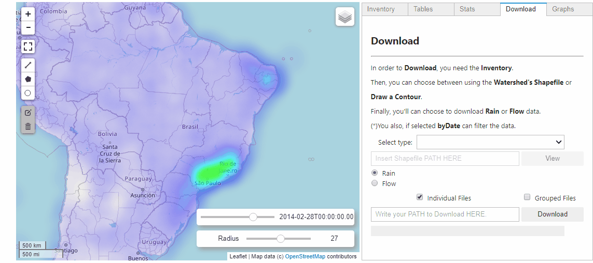
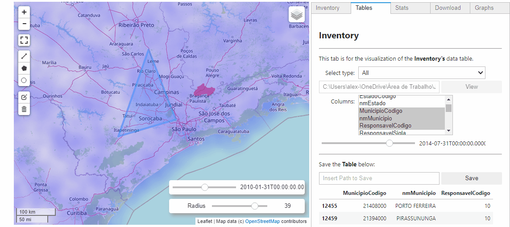

# LHC Hidroweb
-------------------------

**Project description:** A JupyterLab and Python application able to download Rain and Flow through National Water Agency's API.

## 1. Visualization of Inventory

Some metadata is necessary to access and visualize the API. You can apply your own Inventory or download it from the Water National Agency.

## 2. Draw or insert your Shapefile to download the data direct through ANA's API

In order to acquire **public** data, you should be able to easily download it with minimum difficulty. After complete the process necessary to use the tool, you'll be able select through:

- **Shapefile**
- **Drawing on the map build**
- **Select by Date**

## 3. Check some basics stats on your selected data

### 3.1. Check the Inventory's data from your selection

### 3.2. And some stats

For more details see [Github LHC_Hidroweb](https://github.com/alexnaoki/LHC_Hidroweb)
