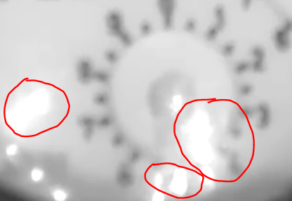
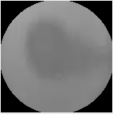
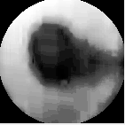

# OpenCV Hydrometer
----------------------------------

**Project description:** A Python application able to read an analog guage (e.g. hydrometer) using [OpenCV](https://opencv.org/) and [Bokeh](https://bokeh.org/). With this tool you will be able to convert a continuous signal (Analog guage) to a discrete signal using a computer vision-type program.

The text below is a summary of the process utilize to achieve the final product. You can get the code utilize at [Github analog-gauge-reader](https://github.com/alexnaoki/analog-gauge-reader).


## 1. Picking a Video File
The first and most important step of utilizing this program will required a **decent** video file.

The factors that makes a **decent** video are the following:
- **No glare** where the analog guage is located.


- **Decent arrow contrast**.

- **No moving** video file.

## 2. Convert RGB to Gray scale
Even if your file appears to be in Gray scale, it is likely that the video is RGB.

```
# Importing OpenCV
import cv2 as cv

# Importing Numpy since we should think the video as a series of Matrices
import numpy as np

# img is a matrix (1048, 1200, 3), where 3 is the RGB portion
img_gray = cv.cvtColor(img, cv.COLOR_BGR2GRAY)
```

## 3. Adjust the Perspective
Ideally the view of the video frame should be perpendicular with the analog gauge to avoid distorsions in the read. OpenCV makes it easy to adjust the perspective, but first you will need 4 references points.

```
# It is up to you to determine the new_width and new_height.
# It is pretty much try and error obtaining good references_points.
warped_frame = cv.warpPerspective(img_gray, references_points, (new_width, new_height))
```

## 4. Inputting Masks, Equalizing and Thresholding the video frame
Depending on your own video file, you can put or drop any of these processes.

```
# Applying Masks in the image
# Since we are working with a clock-type gauge, first we will create a Circle mask as follows
mask = cv.circle(mask, center=(int(height/2), int(width/2)), radius=radius, color=(255,255,255), thickness=-1)

# Then applying the mask on top of the frame
clock = np.bitwise_and(warped_frame, mask)
```

Some videos with poor contrast can be solved by Equalizing the image.

Without Equalizing             |  With Equalizing
:-------------------------:|:-------------------------:
  |  

```
# Equalizing the image
clock_eq = cv.equalizeHist(clock)
```

And finally, we remove extreme values. The minimum and maximum is a try and error process.
```
# Applying a threshold for the image
# The values can vary from 0 to 255
_, clock_t = cv.threshold(clock_eq, min_treshold, max_treshold, cv.THRESH_BINARY_INV)
```

## 5. Finding Contour
This program relies on the contour of the arrow of the analog gauge. There are other tecniques that relies on [Hough Lines](https://docs.opencv.org/3.4/d9/db0/tutorial_hough_lines.html), but depending on your gauge arrow it can be unreliable.

```
# This function will find all contours based on the method call "CHAIN_APPROX_SIMPLE", there are other methods that you can also try
clock_c, _ = cv.findContours(clock_t, cv.RETR_TREE, cv.CHAIN_APPROX_SIMPLE)
```

## 6. Getting the discrete value
You will need to filter the differents contours that the previous method will find and find the edge of the arrow.

After you find the point of the gauge, by analising the relative position of it and the center you can calculate the estimated value.

The final product also uses Bokeh for visualization.


For more details see [Github](https://github.com/alexnaoki/analog-gauge-reader).

You can make suggestion by contacting me on [Twitter](https://twitter.com/AlexNAKobayashi), or any other social media.
